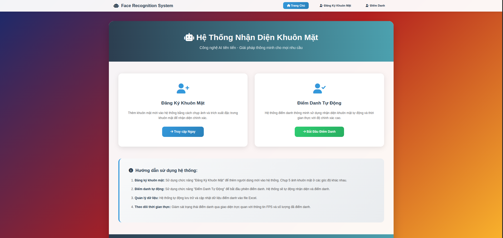
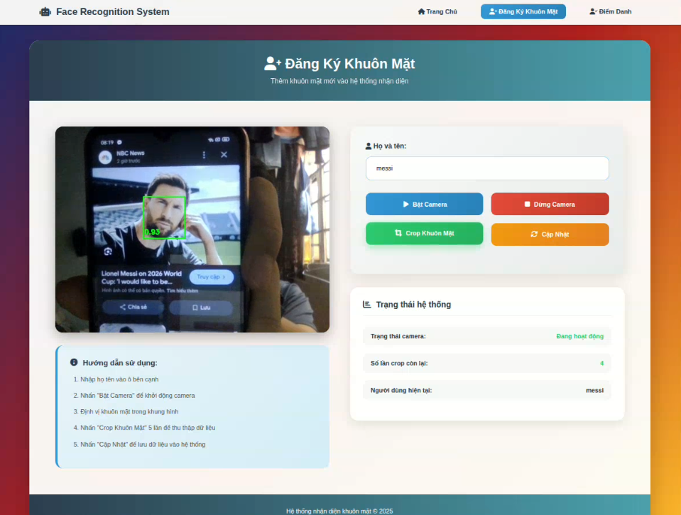
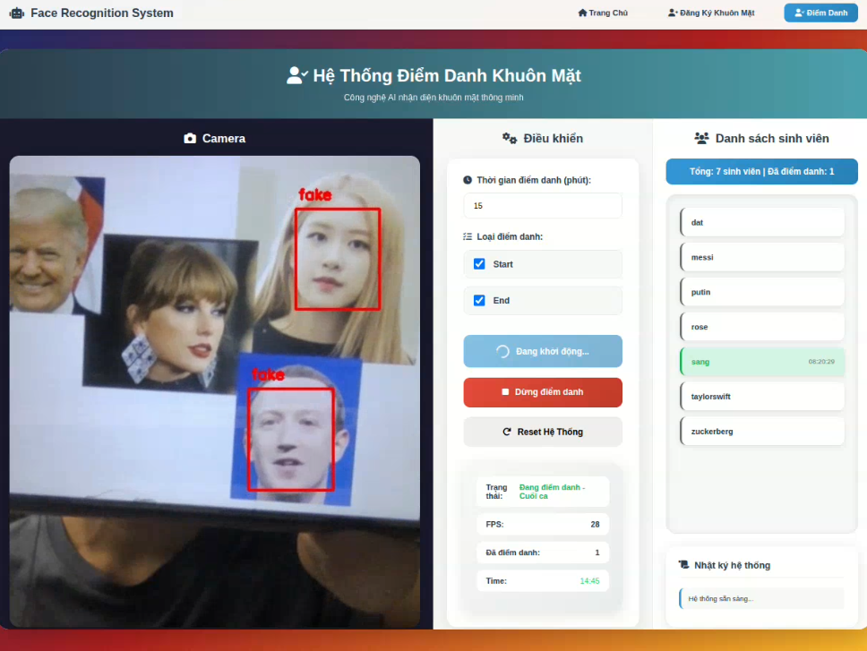

# 🧠🤖 Face Attendance System (FaceNet + YOLOv8 + TensorFlow + Flask)

An **AI-powered Face Recognition Attendance System** built with  **FaceNet**, **YOLOv8**, **TensorFlow**, and **Flask**.  
This project enables real-time **face registration**, **automatic attendance tracking**, and **data export** to Excel files.  
It’s designed to provide a smart, modern, and efficient attendance solution powered by deep learning.

---

## 🚀 Key Features

✅ **Face Registration:**  
Register new users by capturing facial images using a webcam.  

✅ **Real-Time Attendance:**  
Detects and recognizes faces live via the camera.  
Automatically logs attendance with timestamps into an Excel sheet.

✅ **Fake Face Detection:**  
Identifies spoofed or fake faces and prevents unauthorized check-ins.

✅ **Data Management:**  
Stores all attendance data in structured Excel files for easy tracking and export.

✅ **Web Interface (Flask):**  
A clean, user-friendly web app for managing all system functions.

---

## 🧩 System Architecture

```
face_attendance/
│
├── collect_data/
│   ├── data/
│   └── collect_data.py
│
├── notebooks/
│   └── yolov8_real_face.ipynb
│
├── outputs/
│   ├── crop_face_dataset/
│   ├── save_model/
│   └── diemdanh.xlsx
│   └── demo/
├── src/
│   ├── crop_face.py
│   ├── diem_danh.py
│   ├── train_face.py
│   └── utils.py
│
├── web_demo/
│   ├── data/
│   ├── templates/
│   ├── app.py
│   ├── crop_face.py
│   ├── diem_danh.py
│   ├── train.py
│   └── utils.py
│
└── requirements.txt
```

---

## ⚙️ Installation

1. **Clone this repository**
   ```bash
   git clone https://github.com/yourusername/face_attendance.git
   cd face_attendance
   ```

2. **Install dependencies**
   ```bash
   pip install -r requirements.txt
   ```

3. **Run the web demo**
   ```bash
   cd web_demo
   python app.py
   ```

4. **Open in browser**
   ```
   http://127.0.0.1:5000
   ```
   
---

## 💡 Note 
> If your camera does not open or displays a black screen, try changing the camera index in the source code:  
> ```python
> cv2.VideoCapture(0) → cv2.VideoCapture(1) or cv2.VideoCapture(2) or cv2.VideoCapture(3)
> ```
> This issue usually depends on your device’s camera driver or the number of connected cameras.
---

## 📦 Pretrained Model
Download pretrained YOLOv8 model:
👉 [YOLOv8 Real vs Fake Face Model](https://drive.google.com/file/d/199pxh5zoe3pCGhe5pIat1KUmLxZ_s6oU/view?usp=drive_link)

---

## 🧠 Technologies Used

- **Python 3.10+**
- **FaceNet**
- **YOLOv8 (Ultralytics)**
- **TensorFlow**
- **MediaPipe**
- **Flask (Web Framework)**
- **OpenCV**
- **scikit-learn**
- **openpyxl**
- **Pillow**

---

## 🧍‍♂️ User Guide

### 1️⃣ Register a Face
- Enter your **name**
- Click **Start Camera**
- Capture **5 images** of your face at different angles
- Click **Crop Face**
- Click **Save / Update** to store the face data

### 2️⃣ Start Attendance
- Open the **Attendance page**
- Click **Start Attendance**
- The system will recognize and log faces automatically
- Attendance results are saved to `outputs/diemdanh.xlsx`

---

## 🖼️ Demo Screenshots

### 🏠 Home Page


### 🧑‍💻 Face Registration


### ✅ Attendance System


---

## 📊 Output Example

The system automatically generates an Excel file:
```
Name        | Date       | Time       | Status
------------------------------------------------
John Doe    | 2025-10-28 | 08:30:15   | Present
Jane Smith  | 2025-10-28 | 08:32:45   | Present
```

---

## 🧪 Model Details

- **FaceNet** is used for face embeding
- **YOLOv8** is used for real-time face detection and classify real/fake.
- **TensorFlow** handles embedding extraction and face recognition.
- The system uses **Mediapipe** for face landmarks and alignment.

---

## 🧰 Requirements

All dependencies are listed in `requirements.txt`:
```
numpy==1.26.4
tensorflow==2.19.0
mediapipe==0.10.21
scikit-learn==1.7.2
openpyxl==3.1.5
ultralytics==8.3.213
Pillow==11.3.0
flask==3.1.2
```

---

## 🏁 Future Improvements

- Add database (MySQL or MongoDB) for persistent storage  
- Support multi-camera attendance  
- Enhance fake-face detection with anti-spoofing CNN  
- Integrate cloud synchronization and mobile view

---

## 🧑‍💻 Author

**Le Huy Sang**  
📧 lehuysang01@gmail.com  
📍 

---

## 🪪 License

This project is licensed under the **MIT License** – free to use and modify with attribution.

---

## ⭐ Acknowledgements

- [Ultralytics YOLOv8](https://github.com/ultralytics/ultralytics)  
- [TensorFlow](https://www.tensorflow.org/)  
- [Flask](https://flask.palletsprojects.com/)  
- [MediaPipe](https://developers.google.com/mediapipe)

---

### 🌟 “AI for Smart Attendance – Simple, Fast, and Efficient.”
