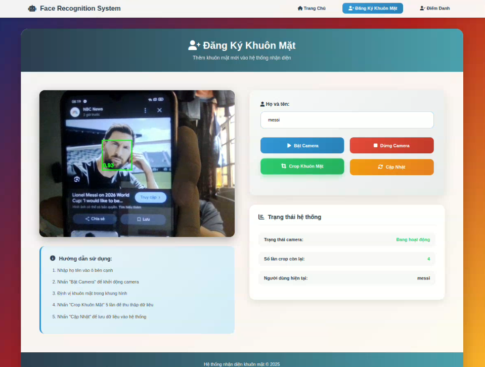
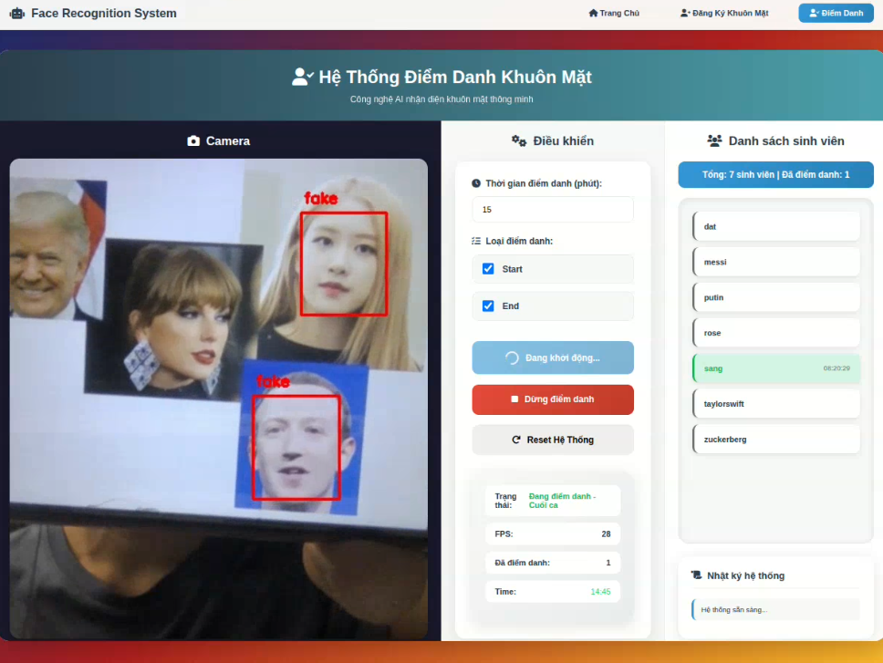

# 🧠🤖 Face Attendance System (YOLOv8 + TensorFlow + Flask)

Hệ thống **điểm danh tự động bằng nhận diện khuôn mặt**, được xây dựng bằng **YOLOv8**, **TensorFlow**, và **Flask**.  
Dự án cho phép người dùng **thu thập dữ liệu khuôn mặt**, **huấn luyện mô hình**, và **thực hiện điểm danh trực tuyến** qua giao diện web thân thiện.

---

## 🚀 Tính năng chính

✅ Nhận diện khuôn mặt thời gian thực qua webcam  
✅ Huấn luyện mô hình nhận diện dựa trên ảnh thu thập  
✅ Giao diện web dễ dùng (Flask)  
✅ Tự động lưu kết quả điểm danh vào file Excel  
✅ Sử dụng YOLOv8 để phát hiện khuôn mặt chính xác, nhanh chóng  

---

## 🧩 Cấu trúc thư mục

```
face_attendance/
├── collect_data/
│   ├── collect_data.py         # Thu thập dữ liệu khuôn mặt real/fake
│   └── data/                   # (tùy chọn) Ảnh khuôn mặt mẫu
│
├── notebooks/
│   └── yolov8_real_face.ipynb  # Notebook huấn luyện / test YOLOv8
│
├── outputs/
│   ├── diemdanh.xlsx   # File điểm danh mẫu
│   ├── crop_face_dataset/      # (tuỳ chọn) Ảnh khuôn mặt đã cắt
│   └── save_model/             # (tuỳ chọn) Model đã huấn luyện    
│   └── demo/      
│   
├── src/
│   ├── crop_face.py            # Cắt khuôn mặt từ ảnh/video
│   ├── diem_danh.py            # Điểm danh bằng mô hình
│   ├── train_face.py           # Huấn luyện mô hình nhận diện
│   └── utils.py                # Hàm tiện ích
│
├── web_demo/
│   ├── app.py                  # Flask server chính
│   ├── templates/              # Giao diện HTML
│   │   ├── index.html
│   │   ├── diem_danh.html
│   │   └── train.html
│   ├── utils.py                # Các hàm tiện ích web
│   └── data/                   # (tùy chọn) Dữ liệu demo
│
├── requirements.txt            # Danh sách thư viện cần thiết
└── README.md                   # Tài liệu hướng dẫn
```

---

## ⚙️ Cài đặt môi trường

### 1️⃣ Clone dự án
```bash
git clone https://github.com/HuySang-04/face_attendance
cd face_attendance
```

### 2️⃣ Tạo môi trường ảo (khuyến khích)
```bash
python -m venv venv
venv\Scripts\activate       # Trên Windows
source venv/bin/activate    # Trên Linux / macOS
```

### 3️⃣ Cài đặt thư viện
```bash
pip install -r requirements.txt
```

---

## 💡 Note 
> Nếu camera của bạn không mở hoặc hiển thị màn hình đen, hãy thử thay đổi chỉ số camera trong mã nguồn:  
> ```python
> cv2.VideoCapture(0) → cv2.VideoCapture(1) or cv2.VideoCapture(2) or cv2.VideoCapture(3)
> ```
> Sự cố này thường phụ thuộc vào trình điều khiển camera của thiết bị hoặc số lượng camera được kết nối.

---


## 🧠 Pretrained Model
Cài đặt pretrained YOLOv8 model:
👉 [YOLOv8 Real vs Fake Face Model](https://drive.google.com/file/d/199pxh5zoe3pCGhe5pIat1KUmLxZ_s6oU/view?usp=drive_link)

---

## 📦 Các thư viện chính

| Thư viện | Phiên bản | Mô tả |
|-----------|------------|-------|
| numpy | 1.26.4 | Xử lý ma trận và dữ liệu |
| tensorflow | 2.19.0 | Huấn luyện mô hình nhận diện |
| mediapipe | 0.10.21 | Phát hiện khuôn mặt |
| scikit-learn | 1.7.2 | Phân loại và đánh giá mô hình |
| openpyxl | 3.1.5 | Làm việc với file Excel |
| ultralytics | 8.3.213 | YOLOv8 để phát hiện khuôn mặt |
| Pillow | 11.3.0 | Xử lý ảnh |
| Flask | 3.1.2 | Giao diện web backend |

---

## 🧠 Cách sử dụng

### 🔹 Bước 1: Thu thập dữ liệu khuôn mặt
Chạy script thu thập ảnh:
```bash
python collect_data/collect_data.py
```
📸 Hệ thống sẽ mở webcam, bạn chỉ cần nhìn vào camera để chụp dữ liệu khuôn mặt.

---

### 🔹 Bước 2: Huấn luyện mô hình
```bash
python src/train_face.py
```
💡 Mô hình sau khi huấn luyện sẽ được lưu trong thư mục `outputs/save_model/`.

---

### 🔹 Bước 3: Chạy ứng dụng web
```bash
cd web_demo
python app.py
```
Sau đó mở trình duyệt và truy cập:  
👉 **http://127.0.0.1:5000**

Tại đây bạn có thể:
- Đăng ký khuôn mặt mới  
- Thực hiện điểm danh  
- Xem lịch sử điểm danh (xuất file Excel)

---

## 🖼️ Demo Website

### 🏠 Trang chủ


### 🧑‍💻 Đăng ký khuôn mặt


### ✅ Điểm danh 


---

## 📊 Kết quả đầu ra

- **File Excel điểm danh:** `outputs/diemdanh.xlsx`  
  Gồm các cột:
  ```
  | Họ tên | Ngày giờ | Trạng thái |
  ```
- **Model đã huấn luyện:** lưu tại `outputs/save_model/`
- **Ảnh khuôn mặt đã cắt:** lưu tại `outputs/crop_face_dataset/`

---

## 🧹 `.gitignore` (đề xuất)

Nếu bạn dùng GitHub, thêm file `.gitignore` với nội dung:
```bash
__pycache__/
*.pyc
*.pyo
.ipynb_checkpoints/
*.h5
*.pt
*.onnx
collect_data/data/
outputs/save_model/
outputs/crop_face_dataset/
.DS_Store
.idea/
.vscode/
```

---

## 🧑‍💻 Tác giả

**Lê Huy Sáng**  
📧 lehuysang01.email@example.com  
📍

---

## 🪪 Giấy phép

Dự án được phát hành theo giấy phép **MIT License** — bạn có thể tự do sử dụng và chỉnh sửa.

---

## ❤️ Góp ý & Phát triển

Mọi ý kiến đóng góp hoặc đề xuất tính năng mới đều được hoan nghênh!  
Hãy tạo **Pull Request** hoặc **Issue** để thảo luận thêm.

---

> 🔥 *Face Attendance System* — Smart attendance, simplified by AI.
